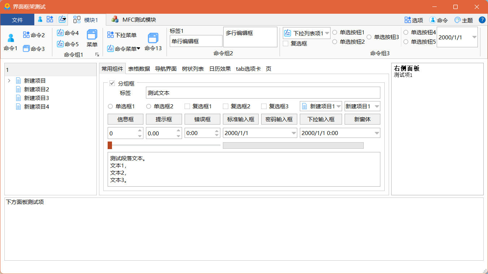
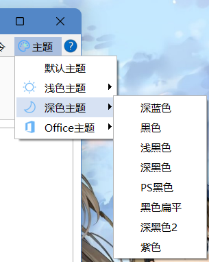

# 基于Qt的模块化界面框架

这是一个界面框架模块，实现了Ribbon风格的样式，使用xml文件配置Ribbon标签页。框架完全使用原生Qt库，无第三方依赖，支持Windows和Linux系统。

此框架可以将Qt或MFC/Win32程序集成到同一个应用程序中。你可以使用Qt或MFC/Win32编写功能模块，并加载到主框架中，并在主框架中以Ribbon标签的方式显示。

工程中包含了一个框架测试程序、一个基于Qt的测试模块、一个基于MFC对话框的测试模块和一个基于Qt的主题模块。

界面框架支持更换主题，内置了十几种风格的主题。主题基于QSS实现，其中部分主题来自开源项目[QSS-Skin-Builder](https://github.com/satchelwu/QSS-Skin-Builder)。

界面截图▼



# 环境说明

* 开发环境： Windows 10 / Windows11
* 开发工具  Qt Creator 10.0.2 / Visual Studio 2022
* Qt 版本  5.15.2
* 编译器版本  Microsoft Visual C++ 2022
* 软件运行环境  Windows 10 / Windows 11

# 目录说明

| 目录        | 说明                                                         |
| ----------- | ------------------------------------------------------------ |
| RibbonFrame | 界面框架核心动态库，包含一个RibbonFrameWindow类作为程序的主窗口。 |
| MainApp     | 界面框架的测试程序，依赖RibbonFrame。                        |
| TestModule  | Qt测试模块，RibbonFrame模块加载时会根据xml中配置的文件名加载该模块。 |
| MFCModule   | MFC测试模块，RibbonFrame模块加载时会根据xml中配置的文件名加载该模块。 |
| StylePlugin | 主题模块，如果需要支持更换主题功能需要加载此模块。           |
| bin         | 输出的二进制文件。                                           |
| common      | 公共的资源文件，需要运行`复制common文件.bat`（或`复制common文件.sh`）将它们复制到bin目录的debug和release目录下。 |
| include     | 公共的头文件。                                               |

# 二次开发说明

## 二次开发步骤

要在你的项目中使用此界面框架，请遵循以下步骤：

* 将MainFrame的依赖添加到你的主工程中，并修改main.cpp中的代码：

  * 添加`include/ribbonframewindow.h`头文件包含，使用`RibbonFrameWindow`类作为程序的主窗口。

  * 你也可以自定义`RibbonFrameWindow`类的派生类作为程序主窗口，在派生类中重写`OnCommand`用于响应需要在主窗口中响应的命令。

* 编辑`common/Mainframe.xml`文件定义框架中的命令、菜单、控件等。关于此文件的编写规则请参照本文档中的“界面xml文件说明”章节。编辑完成后需要运行`复制common文件.bat`（或`复制common文件.sh`）。

* 添加你自己的功能模块。

  * 在你的工程中添加一个动态库项目作为一个功能模块，并在`common/Mainframe.xml`中的`Page`节点中配置模块的名称。

  * 模块类必须实现`IModule`接口，并实现以下必要的虚函数：

    | 虚函数            | 说明                                                         |
    | ----------------- | ------------------------------------------------------------ |
    | InitInstance      | 模块被加载后由框架调用，在这里添加一些初始化的代码。         |
    | UnInitInstance    | 模块被析构前由框架调用，在这里添加一些清理、保存的代码。     |
    | UiInitComplete    | 界面加载完成后由框架调用，并传递`IMainFrame`接口的指针，可以通过此指针调用框架接口。 |
    | GetMainWindowType | 返回主窗口的类型，如果模块是一个Qt工程，则返回`IModule::MT_QWIDGET`，如果是一个MFC工程，则返回`IModule::MT_HWND`。 |
    | GetMainWindow     | 根据GetMainWindowType的返回值返回一个QWidget对象的指针或HWND句柄。为框架提供一个主窗口作为此模块的主窗口。 |
    | GetModuleName     | 返回此模块的名称。此名称为框架区分不同模块的唯一标识，不同模块的名称不能相同。 |
    | OnCommand         | 当主窗口触发了一个命令时由框架调用。响应框架中命令的触发事件必须在此函数中。 |
    
  * 模块导出一个名为`CreateInstance()`的函数，在函数中创建模块类的对象，并返回其指针。此对象在模块中创建，并由框架负责释放。
  
  如果需要添加的模块不需要界面，并且不需要关联Ribbon页面，请在xml文件的`Plugins`节点下配置要添加的插件。例如本工程中的`StylePlugin`模块。

## 集成基于MFC的模块

你还可以将一个基于对话框的MFC工程集成到框架中，并在框架中显示MFC的主窗口。

要集成MFC模块，请参照`MFCModule`里的示例代码。

## 模块间通信

模块中重写`IModule`接口中的虚函数`UiInitComplete`，此函数会传递`IMainFrame`接口的指针，保存此指针。

* 调用`IMainFrame::SendModuleMessage`向模块发送一个消息。

* 在模块实现类中重写`IModule`接口的`OnMessage`函数，使用`SendModuleMessage`函数向此模块发送了消息时，此函数会被调用。

# 界面xml文件说明

界面框架使用xml文件配置界面，xml文件名为`MainFrame.xml`，必须位于可执行文件同一级目录下。

## root节点

xml文件唯一的根节点。

**属性说明**

* appName：程序的名称，用于显示在标题栏和右下角通知的默认标题。
* font：字体名称。
* fontSize：字体的大小。

## MainWindow节点

MainWindow节点下包含所有主窗口元素，例如Page、SystemMenu、QuickAccessBar、Action。这些节点可以放在MainWindow节点下，也可以直接放在root节点（根节点）下。

**属性说明**

- title：窗口标题

  如果有此属性，则用此属性的值作为窗口标题，否则使用root节点下appName属性的值作为窗口标题。

## Page节点

Page节点为主界面中的一个标签页，对应一个模块。

在主界面中切换到一个标签页时，会显示对应模块的主窗口。


**属性说明**

* name：模块名，用于显示在标签页上。
* modulePath：需要加载的模块的路径。（必须使用相对路径，不需要扩展名，框架会自动根据当前系统系统类型加载正确的动态库。如果动态库就放在可执行目录相同目录下，只需将modulePath属性配置为动态库的文件名即可。）

你也可以在多个Page节点中指定相同的modulePath属性，此时多个标签将对应同一个模块，切换到这些标签时，显示的都该模块的主窗口。

## Action节点

Action节点用于设置模块标签页下工具栏中的命令、菜单下的命令，以及标签栏右上角的命令。

**属性说明**

* name：用于显示在工具栏中命令的名称。

* icon：用于显示在工具栏中命令的图标的路径。

* id：命令的ID，用于在程序中响应命令、设置命令状态时需要用到的ID。注意：即使在不同模块中，每个命令的ID也必须是唯一的。

* checkable：设置此命令是否可以被选中。

* tip：设置鼠标指向此命令时的鼠标提示。

* radioGroup：命令组号，用于设置此命令是否要和其他命令组成一组单选按钮，也就是说，处于同一个命令组的命令，一次只会有一个命令被选中。注意：即使在不同模块中，不同命令组的ID也不能相同。

* shortcut：执行此命令的快捷键

* smallIcon：是否为小图标，如果为true，则若干个连续的小图标会在工具栏中垂直排列以节省空间。

* btnStyle：命令的风格，可以为以下值之一：

  * compact：紧凑按钮，文本显示在图标旁边，效果同smallIcon为true。
* textOnly：仅文本，即使指定了icon属性也不显示图标。
  * iconOnly：仅图标，不显示文本。

## ActionGroup节点

将若干个Action和其他控件添加到一个组中。

**属性说明**

* name：组的名称。
* optionBtn：是否在命令组的右下角显示选项按钮。
* id：当optionBtn属性为true时点击选项按钮，OnCommand函数会传递此ID。

Page节点下的Action节点可以放到ActionGroup节点下，也可以直接放到Page节点下。

## Separator节点

显示在工具栏中的分隔符。

## Menu节点

在工具栏中显示一个有下拉菜单的按钮

**属性说明**

* name：菜单按钮的名称

* icon：菜单按钮的图标

* menuBtn：如果为true，此按钮显示为按钮和箭头两部分，点击按钮部分响应命令，点击箭头部分显示下拉菜单。如果为false，则此按钮只有一个部分，点击后直接显示下拉菜单。

* id：命令id，当menuBtn为true时有效

* smallIcon：同Action节点

* btnStyle：同Action节点

Menu节点下面可以包含Action节点、Separator节点和其他控件节点，也可以嵌套Menu节点。

## SystemMenu节点

显示在界面左上角按钮，点击后会弹出系统菜单

**属性说明**

* name：按钮上的文本
* icon：按钮上的图标

SystemMenu节点下面可以包含Action节点、Separator节点和其他控件节点，也可以嵌套Menu节点。

## QuickAccessBar节点

显示在界面左上角的快速启动栏，子节点可以是Action节点、Separator节点和Menu节点。

## Label节点

添加一个QLabel对象。

## LineEdit节点

添加一个QLineEdit对象。

**属性说明**

* editable：是否可以编辑。未指定时为true

## TextEdit/Edit节点

添加一个QTextEdit对象。

**属性说明**

* editable：是否可以编辑。未指定时为true

## ComboBox节点

添加一个QComboBox对象。

**属性说明**

* editable：是否可以编辑。未指定时为false

## CheckBox节点

添加一个QCheckBox对象。

## RadioButton节点

添加一个QRadioButton对象。

**属性说明**

* radioGroup：设置QRadioButton所在组，具有相同radioGroup值的RadioButton为同一组。

## ListWidget节点

添加一个QListWidget对象。

**属性说明**

* horizontalArrange：如果为true，则ListWidget中的项目为水平排列。

## UserWidget节点

添加一个用户自定义控件。

当框架需要创建此控件时，会调用对应`IModule`接口中的`CreateRibbonWidget`函数，模块需要在此函数中根据id创建自定义控件，并返回控件的指针。

## Plugins节点

Plugins节点用于配置需要加载的无界面模块。类似于Page节点，但是在这里配置的模块将不会显示主窗口。

Plugins节点必须位于根节点下。

每个模块在子节点Plugin中配置，path属性为插件的路径，同Page节点的modulePath属性。

# 更换主题

框架支持更换主题，如果需要让框架支持更换主题，需要加载`StylePlugin`模块。

在`MainFrame.xml`中通过`Plugins`加载主题插件：

```xml
<Plugins>
	<Plugin path="StylePlugin"/>
</Plugins>
```

然后在`MainFrame.xml`中添加如下代码：

```xml
<Menu name="主题" icon="./Image/color.png" id="Theme" btnStyle="compact">
	<Action name="默认主题" id="DefaultStyle" checkable="true"/>
</Menu>
```

其中“主题”菜单的id必须为`Theme`，菜单下包含一个id为`DefaultStyle`的Action。

`StylePlugin`模块会自动查找id为`Theme`的菜单，并在菜单下添加其他支持的主题。如果主题加载成功，“主题”菜单将如下图所示：


